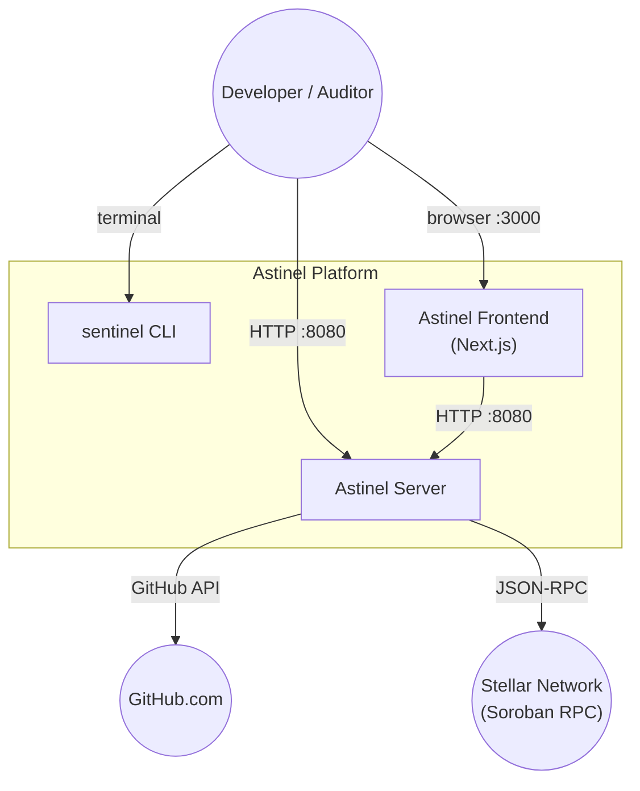
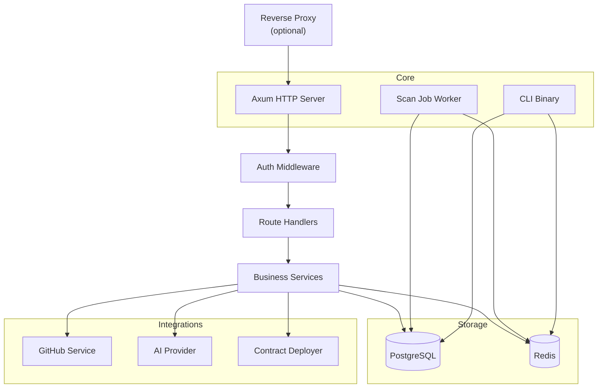
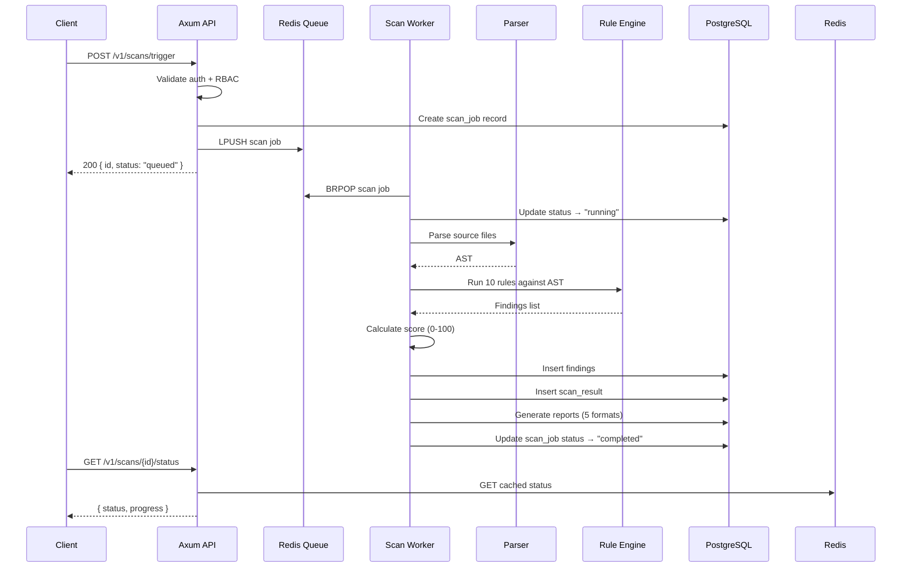
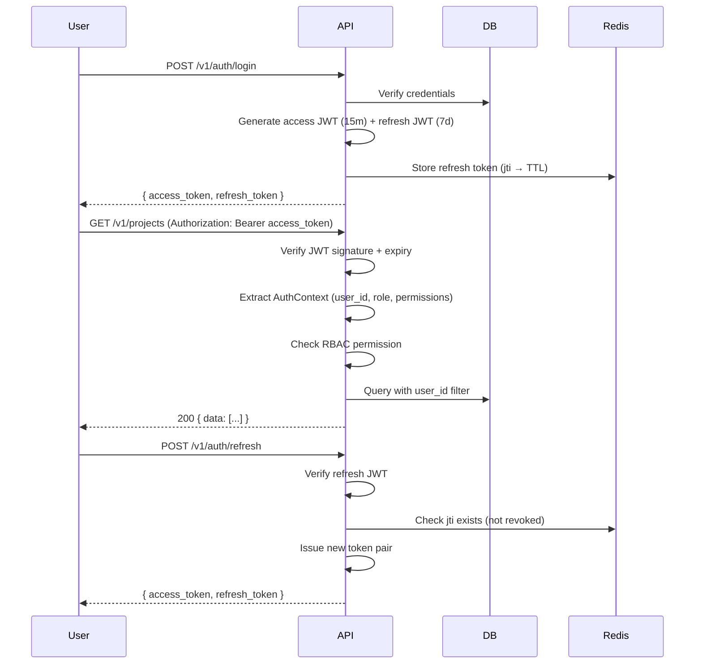
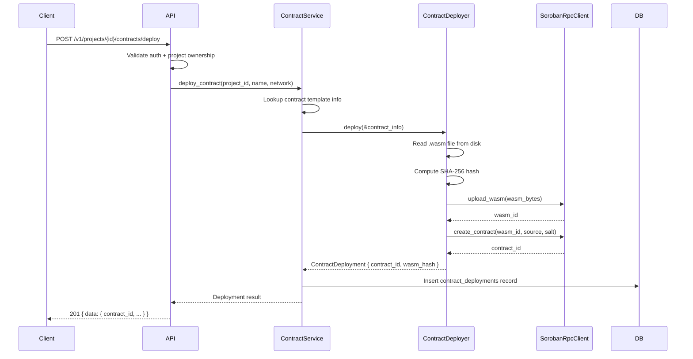

# Architecture

## System Context

## Container Architecture

## Scan Pipeline

## Auth Flow

## RBAC Model

4 roles, 12 permissions:

| Role | Inherits | Key Permissions |
|---|---|---|
| Owner | Admin | ManageMembers, Administer, ManageSettings |
| Admin | Developer | ManageApiKeys, ManageWebhooks |
| Developer | Viewer | CreateProject, UpdateProject, TriggerScan |
| Viewer | — | ViewScan, ViewReport, ViewFindings |

## Contract Deployment Flow

## Built-in Rules

| Rule ID | Severity | Category | Detection |
|---|---|---|---|
| missing-require-auth | Critical | Security | Functions missing `caller.require_auth()` |
| unsafe-panic | High | Security | Bare `panic!()` or `unwrap()` in contract code |
| auth-mistake | High | Security | Incorrect `require_auth` target address |
| integer-overflow | High | Security | Unchecked arithmetic operations |
| large-storage-write | Medium | Performance | Persistent storage writes exceeding threshold |
| missing-ttl | Medium | Gas | `extend_ttl` not called after persistent writes |
| contract-upgrade | Medium | Upgrade | Direct `update_current_contract_wasm` calls |
| dead-code | Low | BestPractice | Unused functions and variables |
| unused-storage | Low | BestPractice | Storage writes without corresponding reads |
| gas-optimization | Info | Gas | Suboptimal patterns (e.g., `Vec` instead of `Map`) |

## Report Formats

| Format | MIME | Use Case |
|---|---|---|
| Pretty | text/plain | Terminal output (colorized, grouped by severity) |
| Compact | text/plain | One finding per line, pipe-delimited |
| JSON | application/json | Programmatic consumption (versioned schema) |
| Markdown | text/markdown | GitHub/GitLab issue or PR comment |
| SARIF | application/sarif+json | GitHub Code Scanning integration |

## Redis Operations

| Component | Key Pattern | Purpose |
|---|---|---|
| SessionStore | `session:refresh:{jti}` | Refresh token validity + TTL |
| RateLimiter | `ratelimit:{key}` | Sliding window counter |
| WebhookDedup | `webhook:dedup:{event_id}` | Idempotent webhook processing |
| ScanStatusCache | `scan:status:{scan_id}` | In-progress scan progress |
| JobQueue | `queue:scans` | Scan job FIFO (LPUSH/BRPOP) |

## Security Model

- Passwords hashed with Argon2id (memory-hard)
- JWT signed with HS256, separate secrets for access and refresh tokens
- Refresh tokens stored in Redis with TTL for revocation
- API keys stored as bcrypt-like hash with prefix for identification
- Stellar wallet auth uses ed25519-dalek challenge-response
- Webhook payloads verified via HMAC-SHA256
- RBAC enforced at the service layer after JWT verification
- Rate limiting via Redis sliding window (configurable per-endpoint)
