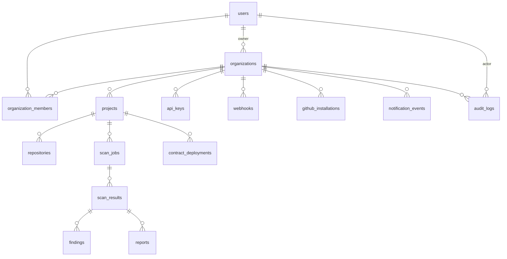

# Database Schema

## Entity Relationship



## Tables

### users

| Column | Type | Constraints |
|---|---|---|
| id | UUID | PK, default gen_random_uuid() |
| email | VARCHAR(255) | NOT NULL, UNIQUE |
| password_hash | VARCHAR(255) | NOT NULL |
| display_name | VARCHAR(128) | |
| avatar_url | TEXT | |
| stellar_public_key | VARCHAR(56) | UNIQUE |
| role | VARCHAR(32) | NOT NULL, default 'developer' |
| last_login_at | TIMESTAMPTZ | |
| is_active | BOOLEAN | NOT NULL, default true |
| created_at | TIMESTAMPTZ | NOT NULL, default now() |
| updated_at | TIMESTAMPTZ | NOT NULL, default now() |
| deleted_at | TIMESTAMPTZ | |

### organizations

| Column | Type | Constraints |
|---|---|---|
| id | UUID | PK |
| name | VARCHAR(255) | NOT NULL |
| slug | VARCHAR(128) | NOT NULL, UNIQUE |
| description | TEXT | |
| owner_user_id | UUID | FK → users.id, NOT NULL |
| billing_plan | VARCHAR(32) | NOT NULL, default 'free' |
| settings | JSONB | NOT NULL, default '{}' |
| is_active | BOOLEAN | NOT NULL, default true |
| created_at | TIMESTAMPTZ | NOT NULL |
| updated_at | TIMESTAMPTZ | NOT NULL |
| deleted_at | TIMESTAMPTZ | |

### organization_members

| Column | Type | Constraints |
|---|---|---|
| id | UUID | PK |
| organization_id | UUID | FK → organizations.id, NOT NULL |
| user_id | UUID | FK → users.id, NOT NULL |
| role | VARCHAR(32) | NOT NULL |
| invited_by | UUID | FK → users.id |
| joined_at | TIMESTAMPTZ | |
| deleted_at | TIMESTAMPTZ | |

UNIQUE(organization_id, user_id)

### projects

| Column | Type | Constraints |
|---|---|---|
| id | UUID | PK |
| organization_id | UUID | FK → organizations.id, NOT NULL |
| name | VARCHAR(255) | NOT NULL |
| slug | VARCHAR(128) | NOT NULL |
| description | TEXT | |
| repository_url | TEXT | |
| default_branch | VARCHAR(255) | NOT NULL, default 'main' |
| language | VARCHAR(32) | NOT NULL, default 'rust' |
| local_path | TEXT | |
| settings | JSONB | NOT NULL, default '{}' |
| created_at | TIMESTAMPTZ | NOT NULL |
| updated_at | TIMESTAMPTZ | NOT NULL |
| deleted_at | TIMESTAMPTZ | |

UNIQUE(organization_id, slug)

### repositories

| Column | Type | Constraints |
|---|---|---|
| id | UUID | PK |
| project_id | UUID | FK → projects.id, UNIQUE, NOT NULL |
| provider | VARCHAR(32) | NOT NULL |
| external_id | VARCHAR(255) | |
| owner | VARCHAR(255) | NOT NULL |
| name | VARCHAR(255) | NOT NULL |
| full_name | VARCHAR(512) | NOT NULL |
| clone_url | TEXT | |
| default_branch | VARCHAR(255) | |
| is_private | BOOLEAN | |
| is_active | BOOLEAN | NOT NULL, default true |

### scan_jobs

| Column | Type | Constraints |
|---|---|---|
| id | UUID | PK |
| project_id | UUID | FK → projects.id, NOT NULL |
| branch | VARCHAR(255) | |
| commit_sha | VARCHAR(64) | |
| status | VARCHAR(32) | NOT NULL, default 'queued' |
| trigger | VARCHAR(32) | |
| config | JSONB | |
| priority | INTEGER | NOT NULL, default 0 |
| queued_at | TIMESTAMPTZ | |
| started_at | TIMESTAMPTZ | |
| completed_at | TIMESTAMPTZ | |
| error_message | TEXT | |

### scan_results

| Column | Type | Constraints |
|---|---|---|
| id | UUID | PK |
| scan_job_id | UUID | FK → scan_jobs.id, UNIQUE, NOT NULL |
| status | VARCHAR(32) | NOT NULL |
| total_files | INTEGER | |
| total_rules | INTEGER | |
| total_findings | INTEGER | |
| suppressed_findings | INTEGER | |
| critical | INTEGER | |
| high | INTEGER | |
| medium | INTEGER | |
| low | INTEGER | |
| info | INTEGER | |
| score | INTEGER | NOT NULL, default 100 |
| duration_ms | BIGINT | |
| raw_output | TEXT | |
| report_hash | VARCHAR(64) | |

### findings

| Column | Type | Constraints |
|---|---|---|
| id | UUID | PK |
| scan_result_id | UUID | FK → scan_results.id, NOT NULL |
| rule_id | VARCHAR(64) | NOT NULL |
| severity | VARCHAR(16) | NOT NULL |
| category | VARCHAR(32) | |
| file_path | TEXT | |
| line | INTEGER | |
| column | INTEGER | |
| message | TEXT | NOT NULL |
| recommendation | TEXT | |
| fix_example | TEXT | |
| is_suppressed | BOOLEAN | NOT NULL, default false |

### reports

| Column | Type | Constraints |
|---|---|---|
| id | UUID | PK |
| scan_result_id | UUID | FK → scan_results.id |
| format | VARCHAR(16) | NOT NULL |
| content | TEXT | |
| file_path | TEXT | |
| file_size | BIGINT | |

### audit_logs

| Column | Type | Constraints |
|---|---|---|
| id | UUID | PK |
| organization_id | UUID | FK → organizations.id |
| actor_id | UUID | FK → users.id |
| action | VARCHAR(64) | NOT NULL |
| resource_type | VARCHAR(64) | |
| resource_id | VARCHAR(64) | |
| details | JSONB | |
| ip_address | INET | |

### api_keys

| Column | Type | Constraints |
|---|---|---|
| id | UUID | PK |
| organization_id | UUID | FK → organizations.id, NOT NULL |
| name | VARCHAR(128) | NOT NULL |
| key_hash | VARCHAR(255) | NOT NULL, UNIQUE |
| key_prefix | VARCHAR(8) | NOT NULL |
| permissions | JSONB | |
| expires_at | TIMESTAMPTZ | |
| last_used_at | TIMESTAMPTZ | |
| is_active | BOOLEAN | NOT NULL, default true |

### webhooks

| Column | Type | Constraints |
|---|---|---|
| id | UUID | PK |
| organization_id | UUID | FK → organizations.id, NOT NULL |
| name | VARCHAR(255) | |
| url | TEXT | NOT NULL |
| secret | TEXT | |
| events | JSONB | |
| is_active | BOOLEAN | NOT NULL, default true |
| last_triggered_at | TIMESTAMPTZ | |
| deleted_at | TIMESTAMPTZ | |

### github_installations

| Column | Type | Constraints |
|---|---|---|
| id | UUID | PK |
| organization_id | UUID | FK → organizations.id, NOT NULL |
| installation_id | BIGINT | NOT NULL, UNIQUE |
| account_login | VARCHAR(255) | |
| account_type | VARCHAR(32) | |
| avatar_url | TEXT | |
| permissions | JSONB | |
| repository_selection | VARCHAR(32) | |

### notification_events

| Column | Type | Constraints |
|---|---|---|
| id | UUID | PK (application-generated) |
| organization_id | UUID | FK → organizations.id |
| event_type | VARCHAR(64) | NOT NULL |
| title | VARCHAR(256) | NOT NULL |
| message | TEXT | |
| severity | VARCHAR(32) | |
| resource_type | VARCHAR(64) | |
| resource_id | UUID | |
| is_read | BOOLEAN | NOT NULL, default false |
| created_at | TIMESTAMPTZ | NOT NULL, default now() |

### contract_deployments

| Column | Type | Constraints |
|---|---|---|
| id | UUID | PK |
| project_id | UUID | FK → projects.id, NOT NULL |
| contract_name | VARCHAR(64) | NOT NULL |
| network | VARCHAR(32) | NOT NULL |
| contract_id | VARCHAR(64) | |
| wasm_hash | VARCHAR(64) | |
| deploy_tx_hash | VARCHAR(64) | |
| version | INTEGER | NOT NULL, default 1 |
| metadata | JSONB | |
| status | VARCHAR(32) | |
| deleted_at | TIMESTAMPTZ | |

UNIQUE(contract_id, network) WHERE deleted_at IS NULL

## Migration Strategy

Migrations are SQL files in `migrations/` prefixed with timestamp:

```
migrations/
  20250101000001_create_users.sql
  20250101000002_create_organizations.sql
  ...
```

Runs automatically on server startup via `sqlx::migrate!()`. All migrations are idempotent.

## Soft Delete

All primary entities (users, organizations, projects, webhooks) use soft delete (`deleted_at`). Queries must include `WHERE deleted_at IS NULL` unless explicitly including deleted records.

## JSONB Usage

| Table | Column | Purpose |
|---|---|---|
| organizations | settings | Feature flags, integration configurations |
| projects | settings | Scan configuration overrides, notification preferences |
| api_keys | permissions | Granular per-key permission scopes |
| webhooks | events | Subscribed event type list |
| audit_logs | details | Free-form action context |
